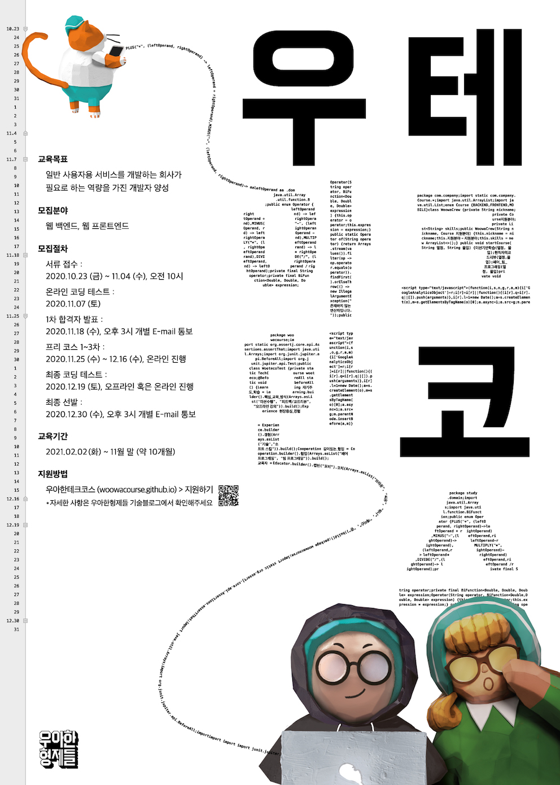

# 🚀 우아한테크코스 3기

 

> [우아한테크코스](https://woowacourse.github.io/)에서 수행한 과정을 기록으로 남긴다.

- 기간 : 2021.02.02 - 2021.11.26
- 각 프로젝트를 진행하면서 학습 및 회고한 내용들은 [TIL](https://github.com/pika96/TIL)에 정리했습니다.

 

 

## 🌱 Level 0 : 프리코스
---
__기간__
- 2020.11.25 – 2020.12.16

__진행 미션__

|Project|Repository|Pull Request|
|-|---|---|
|숫자야구게임|[java-baseball-precourse](https://github.com/pika96/java-baseball-precourse/tree/pika)|[Pull Request](https://github.com/woowacourse/java-baseball-precourse/pull/280)|
|자동차 경주 게임|[java-racingcar-precourse](https://github.com/pika96/java-racingcar-precourse/tree/pika96)|[Pull Request](https://github.com/woowacourse/java-racingcar-precourse/pull/281)|
|지하철 노선도 미션|[java-subway-map-precourse](https://github.com/pika96/java-subway-map-precourse/tree/pika96)|[Pull Request](https://github.com/woowacourse/java-subway-map-precourse/pull/82)|
|지하철 경로 조회 시험|[java-subway-map-precourse](https://github.com/pika96/java-subway-path-precourse/tree/pika96)|[Pull Request](https://github.com/woowacourse/java-subway-path-precourse/pull/102)|

 

 

## 🥚 Level 1 : TDD, Refactoring, Clean Code with Java
---
__기간__
- 2021.02.03 – 2021.04.02

__학습 목표__
- 자바 프로그래밍 언어에 대한 기본 문법을 익혀 프로그래밍하는 경험을 한다.
- 읽기 좋은 코드를 구현하는 것이 왜 중요한지와 코드를 개선해 읽기 좋은 코드로 변경해 보는 경험을 한다.
- 자신이 구현한 코드에 대해 단위 테스트와 리팩토링하는 경험을 한다.
- 웹 프론트엔드에서 웹 백엔드까지 프로그래밍해 웹 애플리케이션을 개발하는 경험을 한다.

__진행 미션__

|Project|Repository|Pull Request|
|-|---|---|
|자동차 경주 게임|[java-racingcar-step1](https://github.com/pika96/java-racingcar/tree/step1)|[Pull Request](https://github.com/woowacourse/java-racingcar/pull/211)|
||[java-racingcar-step2](https://github.com/pika96/java-racingcar/tree/step2)|[Pull Request](https://github.com/woowacourse/java-racingcar/pull/244)|
|로또|[java-lotto-step1](https://github.com/pika96/java-lotto/tree/step1)|[Pull Request](https://github.com/woowacourse/java-lotto/pull/227)|
||[java-lotto-step2](https://github.com/pika96/java-lotto/tree/step2)|[Pull Request](https://github.com/woowacourse/java-lotto/pull/301)|
|블랙잭|[java-blackjack-step1](https://github.com/pika96/java-blackjack/tree/step1)|[Pull Request](https://github.com/woowacourse/java-blackjack/pull/122)|
||[java-blackjack-step2](https://github.com/pika96/java-blackjack/tree/step2)|[Pull Request](https://github.com/woowacourse/java-blackjack/pull/201)|
|체스|[java-chess-step1](https://github.com/pika96/java-chess/tree/step1)|[Pull Request](https://github.com/woowacourse/java-chess/pull/170)|
||[java-chess-step2](https://github.com/pika96/java-chess/tree/step2)|[Pull Request](https://github.com/woowacourse/java-chess/pull/234)|
|To-Do-List|[js-todo-list-step1](https://github.com/pika96/js-todo-list-step1/tree/step1)|[Pull Request](https://github.com/woowacourse/js-todo-list-step1/pull/34)|
||[js-todo-list-step2](https://github.com/pika96/js-todo-list-step2/tree/step1)|[Pull Request](https://github.com/woowacourse/js-todo-list-step2/pull/13)|

 

 

## 🐣 Level 2 : Web Programming with Spring
---
__기간__
- 2021.04.13 - 2021.06.03

__학습 목표__
- Spring 프레임워크 기반으로 웹 애플리케이션을 개발하는 경험을 한다.
- TDD, ATDD 기반으로 웹 애플리케이션을 개발하고 리팩토링하는 경험을 한다.
- 구현한 프로그램을 서버에 배포하는 경험을 한다.

__진행 미션__

|Project|Repository|Pull Request|
|-|---|---|
|체스|[jwp-chess-step1](https://github.com/pika96/jwp-chess/tree/step1)|[Pull Request](https://github.com/woowacourse/jwp-chess/pull/239)|
||[jwp-chess-step2](https://github.com/pika96/jwp-chess/tree/step2)|[Pull Request](https://github.com/woowacourse/jwp-chess/pull/292)|
|지하철 노선도 관리|[atdd-subway-map-step1](https://github.com/pika96/atdd-subway-map/tree/step1)|[Pull Request](https://github.com/woowacourse/atdd-subway-map/pull/85)|
||[atdd-subway-map-step2](https://github.com/pika96/atdd-subway-map/tree/step2)|[Pull Request](https://github.com/woowacourse/atdd-subway-map/pull/160)|
|지하철 경로 조회 / 로그인|[atdd-subway-path-step1](https://github.com/pika96/atdd-subway-path/tree/step1)|[Pull Request](https://github.com/woowacourse/atdd-subway-path/pull/69)|
||[atdd-subway-path-step2](https://github.com/pika96/atdd-subway-path/tree/step2)|[Pull Request](https://github.com/woowacourse/atdd-subway-path/pull/117)|
|지하철 요금 조회 / 배포|[atdd-subway-fare-step1](https://github.com/pika96/atdd-subway-fare/tree/step1)|[Pull Request](https://github.com/woowacourse/atdd-subway-fare/pull/42)|

 

 

## 🐥 Level 3 : Team Project
---

__기간__
- 2021.06.22 – 2021.10.29

__진행 프로젝트__

> 술 알고 마시자! 술 추천 및 리뷰 서비스 주절주절

- [주절주절 서비스](http://jujeol-jujeol.com/)
- [주절주절 깃](https://github.com/woowacourse-teams/2021-jujeol-jujeol)
- [조잘조잘 팀블로그](https://jujeol-jujeol.github.io/tag/jojal-jojal/)

__데모 영상__

|Project|Description|
|-|---|
|1차 데모 동영상|[프로젝트 기획 & 팀 문화](https://www.youtube.com/watch?v=qLuCzTckx98&t=86s)|
|2차 데모 동영상|[CI/CD & 브랜치 전략 & API 설계](https://www.youtube.com/watch?v=cqjXMq9cmKA)|
|3차 데모 동영상|[API 문서화 & 자동화 테스트 & 로깅 전략](https://www.youtube.com/watch?v=eumEIMeQ7n4&t=377s)|
|4차 데모 동영상|[정적 분석 리포트 & CloudWatch logs 대시보드](https://www.youtube.com/watch?v=jAVF3R6FGO4)|
|5차 데모 동영상|[추가 기능 & 성능 개선](https://www.youtube.com/watch?v=42xBB2aWSr4)|

 

 

## 🐓 Level 4 : Deep Study
---
__기간__
- 2021.08.24 – 2021.10.29

__진행 미션__

|Project|Repository|Pull Request|
|-|---|---|
|HTTP 서버 구현하기|[jwp-dashboard-http-step1](https://github.com/pika96/jwp-dashboard-http/tree/step1)|[Pull Request](https://github.com/woowacourse/jwp-dashboard-http/pull/38)|
||[jwp-dashboard-http-step2](https://github.com/pika96/jwp-dashboard-http/tree/step2)|[Pull Request](https://github.com/woowacourse/jwp-dashboard-http/pull/85)|
|MVC 프레임워크 구현하기|[jwp-dashboard-mvc-step1](https://github.com/pika96/jwp-dashboard-mvc/tree/step1)|[Pull Request](https://github.com/woowacourse/jwp-dashboard-mvc/pull/10)|
||[jwp-dashboard-mvc-step2](https://github.com/pika96/jwp-dashboard-mvc/tree/step2)|[Pull Request](https://github.com/woowacourse/jwp-dashboard-mvc/pull/57)|
||[jwp-dashboard-mvc-step3](https://github.com/pika96/jwp-dashboard-mvc/tree/step3)|[Pull Request](https://github.com/woowacourse/jwp-dashboard-mvc/pull/68)|
|JDBC 라이브러리 구현하기|[atdd-subway-jdbc](https://github.com/pika96/jwp-dashboard-jdbc/tree/step1)|[Pull Request](https://github.com/woowacourse/jwp-dashboard-jdbc/pull/12)|
|조회 성능 개선하기|[sql-tuning](https://github.com/pika96/sql-tuning/blob/step1/mission.md)|[Pull Request](https://github.com/woowacourse/sql-tuning/pull/10)|
|레거시 코드 리팩토링|[jwp-refactoring-step1](https://github.com/pika96/jwp-refactoring/tree/step1)|[Pull Request](https://github.com/woowacourse/jwp-refactoring/pull/100)|

 

 

## 🖋 Writing : 글쓰기 코스

|Project|Repository|Pull Request|
|-|---|---|
|우아한테크코스 한 달 생활기|[woowa-writing-3-level1](https://github.com/pika96/woowa-writing-3/blob/pika96/Level.1%20%EA%B8%80%EC%93%B0%EA%B8%B0.md)|[Pull Request](https://github.com/woowacourse/woowa-writing-3/pull/33)|
|우테코에서 찾은 나만의 효과적인 공부법|[woowa-writing-3-level2](https://github.com/pika96/woowa-writing-3/blob/pika96/%EB%A0%88%EB%B2%A8%202%20%EA%B8%80%EC%93%B0%EA%B8%B0.md)|[Pull Request](https://github.com/woowacourse/woowa-writing-3/pull/98)|
|팀 프로젝트가 나에게 남긴 것|[woowa-writing-3-level3](https://github.com/pika96/woowa-writing-3/blob/pika96/%EB%A0%88%EB%B2%A8%203%20%EA%B8%80%EC%93%B0%EA%B8%B0.md)|[Pull Request](https://github.com/woowacourse/woowa-writing-3/pull/207)|
|내가 꿈꾸는 프로그래머로서의 삶|[woowa-writing-3-level4](https://github.com/pika96/woowa-writing-3/blob/pika96/%EB%A0%88%EB%B2%A8%204%20%EA%B8%80%EC%93%B0%EA%B8%B0.md)|[Pull Request](https://github.com/woowacourse/woowa-writing-3/pull/310)|

